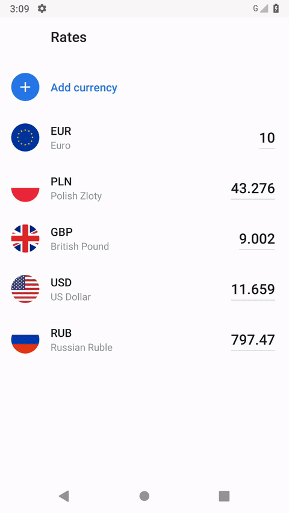

# Currencies
[](https://github.com/svanegas/revolut_currencies/blob/develop/extras/Currencies-1.1.0-101000-20190903-productionRelease.apk?raw=true)


> A simple Android application to know the exchange for a selected set of currencies

---

## Table of contents

  * [Functionality](#functionality)
  * [How is it built](#how-is-it-built)
  * [How it looks like](#how-it-looks-like)
  * [Dependencies](#dependencies)
  * [Setup](#setup)
  * [How to launch Currencies](#how-to-launch-currencies)
  * [Known issues](#known-issues)

## Functionality

The application allows users to check the exchange for a selected set of currencies, which are:
Euro, US Dollar, British Pound and Czech Koruna.

This initial version restricts to those currencies, but in further versions user will be able to
choose an additional currency from the list to be converted.

Every time the user taps on a currency value, it would go to the top, becoming the **base** currency,
all the other values are calculated based on the first one.

The list contains live information that is automatically refreshed.

## How is it built

_Currencies_ is built using the **Android SDK** version 28, with backwards
compatibility down to devices running _Android Lollipop (26)_. **MVVM Architecture** was used in the project. [Google Design Guidelines] were also
implemented in order to create a comfortable UX and UI.

## How it looks like
| Animation |
|:---:|
|  |

## Dependencies

Currencies app is powered by great tech. The following dependencies were used to build the project.

- [Android X]
- [Dagger 2]
- [RxJava 2]
- [Retrofit]
- [Glide]
- [Firebase]
- [Crashlytics]
- [Timber]

## Setup

The project is expected to be built and run using [Android Studio] 3.5+, make sure you have
installed a proper version.

Open Android Studio and select the **Open an existing Android Studio project** option, then select
the project root and wait for the project to sync.

There are two flavors and two build types, making a total of 4 build variants.

- `devDebug`
- `devRelease`
- `productionDebug`
- `productionRelease`

In order to build `release` builds you would need to generate a key store to sign the app.
Once you have your key store save it as `currencies.jks` under the `extras/keystore` folder, and also,
create a file `currencies.properties` to save the key store settings, as follows:

```
keystore.key.password=123abc
keystore.store.password=456def
keystore.key.alias=alias1
```

## Known issues

There are some issues that were identified during the development process but they haven't been solved yet:

- There's no loading screen
- There's no empty screen
- The app doesn't provide offline support
- There is no error management
- The currency inputs are limited to 20 characters, which will truncate a conversion that would take more
- When there's several currencies, selecting one from the bottom will create a loop of focus/unfocus, making the app go crazy.

## What's next?

The project would need a nice touch to be better, including:

- Unit tests!
- Continuous Integration / Continuous Deployment
- Analytics
- Offline support (caching)
- Ability to add and delete currencies from the list
- ...

> Santiago Vanegas

[Android X]:https://developer.android.com/jetpack/androidx
[Dagger 2]:https://google.github.io/dagger/
[RxJava 2]:https://github.com/ReactiveX/RxJava
[Retrofit]:http://square.github.io/retrofit/
[Glide]:https://github.com/bumptech/glide
[Google Design Guidelines]:https://design.google.com/
[Android Studio]:https://developer.android.com/studio/index.html
[Firebase]:https://firebase.google.com
[Crashlytics]:https://firebase.google.com/products/crashlytics
[Timber]:https://github.com/JakeWharton/timber
